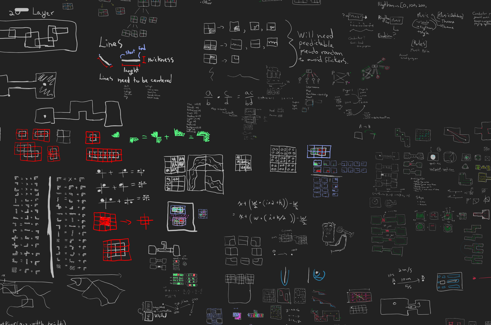

I've been meaning to share this tip for a while. About one year ago, I discovered a software called [Milton](https://github.com/serge-rgb/milton). It's a drawing application that lets you draw on an infinite canvas with an amazing zooming function. It's incredibly fast and the interface doesn't get in your way. It turns out it's really useful for taking notes or thinking about how to solve problems visually.

Here is a snapshot of a small portion of the notes I took while working on my game [Rashtal](http://rashtal.com/):

To take notes easily, I have the Wacom Bamboo as my graphics tablet. If you don't have a graphics tablet yet, I'd suggest getting one. Even the cheapest one should do the job perfectly.

Before using Milton, I would use a pen and paper, but for some complex algorithms, I find the infinite canvas to be much easier to work with. Once I've been working on a project for a while, the canvas starts to look really impressive.

I find that being able to see all the notes I've taken since starting to work on a project really helps me stay motivated. Sometimes I can spend days barely writing any lines of code but then I look at my notes and I can see my thought process and all the planning I went through. Even the simplest lines of code can take a long time to figure out and I tend to forget that.

---

Thanks for taking the time to read this and good luck with your algorithm planning!
