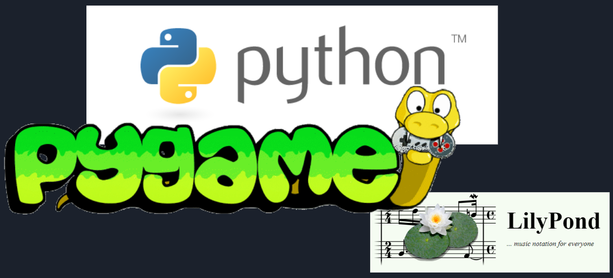
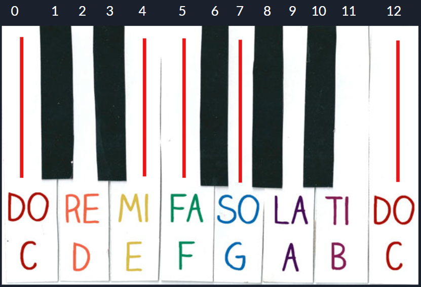
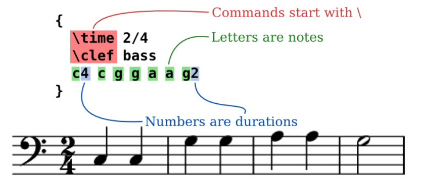
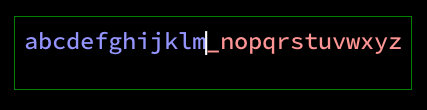
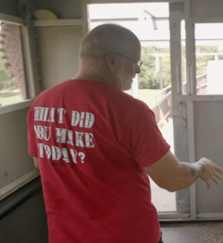

## Prologue

In February 26, 2020, I gave a 15-minute talk for [SaglacIO](https://saglac.io/) in front of a bit more than 60 people. It was hosted by my former employer [CONFORMiT](https://www.conformit.com/). My talk was about weekend projects for programmers.

## Intro

Before I get into that though, I want to backtrack a little bit. There's something really cool called speed paintings. In a relatively short amount of time, artists can produce some really nice artworks. You can watch a bit of the following video:

<div class="relative pb-16/9">
    <iframe class="absolute w-full h-full" src="https://www.youtube.com/embed/u2dycJv55aQ" frameborder="0" allow="accelerometer; autoplay; encrypted-media; gyroscope; picture-in-picture" allowfullscreen></iframe>
</div>

Something to notice specifically, the artist above, [Jorge Jacinto](https://www.artstation.com/jjcanvas), starts by copy pasting his existing work, he moves and rotates things around. He quickly gets a composition going, puts rough shapes in place. Over time, that composition barely changes. Even if you skip to the end of the video, the foundation is still there. In programming projects, it's really similar. You can work on something for a long time, and quite often, what you do early doesn't change too much. The initial work done on a project sets the ground for weeks to come.

Another interesting concept I want to bring is this:

<div class="relative pb-16/9">
    <iframe class="absolute w-full h-full" src="https://www.youtube.com/embed/IYVcjFhpsHc" frameborder="0" allow="accelerometer; autoplay; encrypted-media; gyroscope; picture-in-picture" allowfullscreen></iframe>
</div>

The Tibetan monks bring something really interesting to the table. They work on a project for weeks and right at the end, they destroy it. For them, it signifies having no attachments. I think that is a really important lesson to think about. Quite often, it's easy to wait until we find that one million dollar idea, but I think it's really good to work on simple projects and to let go of them at the end.

## Definition

Now that I have brought these two concepts forward, this is where weekend projects come in. My definition of a weekend project is as follows:

* Short, roughly 4 to 8 hours long.
* Focused
* Instant results
* Rapid feedback
* No time to drop out

When you start getting into weekend projects, it might take a bit more time than 4 to 8 hours, but try your best to not get carried away and control your scope. Keep it short and focused. You get faster as you build experience. Once you're ready, show it to your friends and get some feedback. Doing things like that means you don't have time to drop out. It's so common for programmers to start some never ending projects and it can get incredibly demotivating. With weekend projects, you can look back at your projects and get a sense of pride. You leave a trail behind you and that's how you grow.

## Weekend projects mindset

It's important to go through your life with a weekend project mindset. Try to notice fields that interest you. Take notes and do some research. Over time, you will get inspired and get new ideas. Build projects from those ideas and share them with others.

## Auto composer a.k.a. Cohortem

Back in 2012, I was reading a book called Measured Tones - The Interplay of Physics and Music by Ian Johnston. It's a really great book that I would recommend. It's written by an astrophysics professor and he explains music using his knowledge of physics. Reading this book, I started to wonder if I could code an algorithm to compose music. At the time, I had a few years of piano experience under my belt.

In order to complete this project, I had only a few simple things to think about. How do I get the computer to emit a sound? How are good notes picked? And as a bonus, how do I generate beautifully engraved music sheets?

At the time, I was learning python and I thought it would be a good language to use for the project. In terms of technology, I was in possession of a midi piano. Instead of having to generate sounds myself, I could connect to my piano using the midi protocol and get some well rendered audio sounds. Midi is quite simple. The main idea is that to play a note, you send a message with the note's number and how loud to play it. In python, doing a search for midi, I found that I could use [pygame](https://www.pygame.org) and it would handle the midi protocol for me. First question answered, now on to the second one.



How do I actually pick notes that sound good together? I was playing random notes on my piano and I quickly determined that I have two hands, I'd have to simulate that. The left hand tends to play chords and the right tends to play melodies. Let's say I would pick the `C` chord on the left hand, then the right hand could play a `C`, `E`, `F`, `G`, and the next `C` for the melody. No matter in which order those would be played, it still sounded good to me. If I transfer the first `C` to 0 and add one for each notes, I get `0`, `2`, `4`, `5`, `6`, `12`. It's pretty trivial to randomly pick a number from that list. This builds my melody. For the chord, it's just `0`, `6`, `12`. Or I can break it note by note and do `0`, `4`, `6`, `12`. I can play that last one forward or backward. To make the music sound better, I generated notes in groups of 4 quarter beats, called a measure. A single quarter beat can be divided in half beats, triplets, etc. I can gather notes together with many different timings and fit them in the measure. That creates some pretty legit music.



Doing a quick search, I found a music engraving program called [Lilypond](https://lilypond.org/). It takes as it's input a text file and outputs a pdf with my music sheet. This is great for me because I can create a conversion table between the notes I generate and the Lilypond source code.



So what does all of that sounds like?

<div class="relative pb-16/9">
    <iframe class="absolute w-full h-full" src="https://www.youtube.com/embed/VFVto2PA1iU" frameborder="0" allow="accelerometer; autoplay; encrypted-media; gyroscope; picture-in-picture" allowfullscreen></iframe>
</div>

It only took 4 hours to code that. I started to wonder what could be done to make it sound better. On the next day, I added a bit of variations to the notes so that they don't all get played with the same volume:

<div class="relative pb-16/9">
    <iframe class="absolute w-full h-full" src="https://www.youtube.com/embed/NzroOqylc-U" frameborder="0" allow="accelerometer; autoplay; encrypted-media; gyroscope; picture-in-picture" allowfullscreen></iframe>
</div>

Overall I was quite happy with how that project turned out. You might think that the project required quite a bit of previous knowledge and it did, but I want to point out that your life matters. You learn stuff, gain experience, and build greater and greater weekend projects.

## Binary Input

One day back in January 2020, I was sitting in front of my TV getting more and more pissed off as I was trying to search a video on YouTube using the apple TV. The remote has a very limited amount of buttons and typing anything takes forever with their input scheme. Is this what the modern world is reduced to? I hopped on [Discord](https://discord.rashtal.com/) and started to brainstorm an idea that would revolutionize the world. Something that is taught in computer science 101. Binary search. It seemed to make so much sense. You start from a row of letters, set the cursor in the center and each consecutive left and right actions cuts the keyboard in half. For example, I want to write `apos`:

```
abcdefghijklm[]nopqrstuvwxyz
abcdef[]ghijklmnopqrstuvwxyz
abc[]defghijklmnopqrstuvwxyz
a[]bcdefghijklmnopqrstuvwxyz
```

Four lefts give me the `a`. Now I want the `p`:

```
abcdefghijklm[]nopqrstuvwxyz
abcdefghijklmnopqrst[]uvwxyz
abcdefghijklmnopq[]rstuvwxyz
abcdefghijklmno[]pqrstuvwxyz
```

Right, left, left, right and bam a `p`. Now the `o`:

```
abcdefghijklm[]nopqrstuvwxyz
abcdefghijklmnopqrst[]uvwxyz
abcdefghijklmnopq[]rstuvwxyz
abcdefghijklmno[]pqrstuvwxyz
```

Right, left, left, left and there's the `o`. And last but not least the `s`:

```
abcdefghijklm[]nopqrstuvwxyz
abcdefghijklmnopqrst[]uvwxyz
abcdefghijklmnopq[]rstuvwxyz
abcdefghijklmnopqr[]stuvwxyz
```

Without any optimizations, this mental exercise already felt quite fast.

I thought about it for the next week and then I went ahead an implemented it live on stream. It took 4 hours in relaxed mode:

<div class="relative pb-16/9">
    <iframe class="absolute w-full h-full" src="https://www.youtube.com/embed/6YO2cDFNMEk" frameborder="0" allow="accelerometer; autoplay; encrypted-media; gyroscope; picture-in-picture" allowfullscreen></iframe>
</div>



You can grab the builds on [itch.io](https://itch.io/): <https://apos.itch.io/binaryinput>.

I posted about the project on [Tildes](https://tildes.net/) and Discord and got some great feedback. Here are some of the comments that I got:

> Okay, this is great, but I'm wondering how this is going to get distributed [soon] to the proprietary devices and systems where it's needed most. - Pistos

> Dude what. This makes so much sense. Perfect for TV remotes and gamepads. Did you come up with this concept? - TurdFerguson

> It's a brilliant concept. I want to see where you go with this. - ThatFanficGuy

> Could also be cool for Brain Computer Interfacing. - the Sage

## Weekend projects mindset 2

As a bonus part of this talk, I want to suggest a technique if you work on a large code base. It can sometimes get quite hard to implement new features when you have to deal with a lot of existing code. Why not implement that new feature as a weekend project? You get results fast, prove the concept, then bring it into the main project. This gives the opportunity to refactor the code as you bring the code in.

## Groups to join

While it's ok to work alone, weekend projects are fun in a team too. Especially if you work with people online, it is quite frequent to start a project and see people disappear after days or weeks. With weekend projects, there's no time to drop off. You get in the zone, then you're done. I suggest Discord first as it's a great place to find active people. Discord communities are very dynamic. People constantly share their own projects which is good for motivation and inspiration. Tildes is a close second. They have weekly threads for people to share what they are working on. The community is still small and it soon feels like a tight group. Reddit is a bit more hit of miss. There's a bit more searching to do but there are people in there that are hidden gems.

* [Rashtal Discord](https://discord.rashtal.com/) - [MonoGame Discord](https://discord.gg/tsuucV4)
* [Tildes](https://tildes.net/)
* [Reddit INAT](https://www.reddit.com/r/INAT/)

## Conclusion

I would like to end this by asking you one question: What did you make today?


